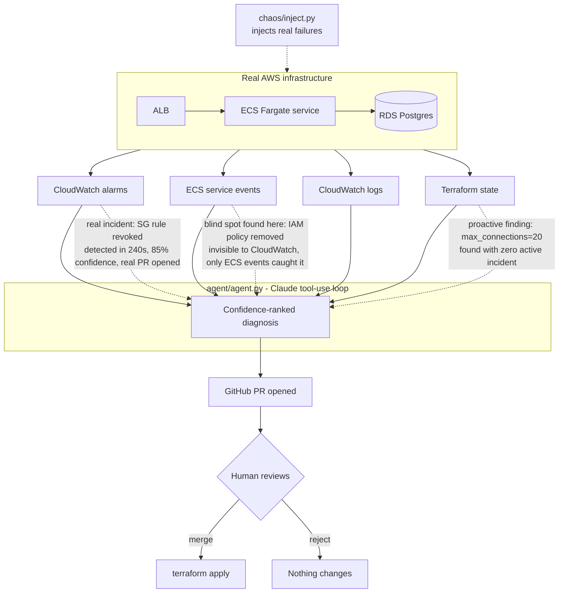

# Infra Whisperer


I built this to give myself a real answer to "show me you can do FDE work" instead of a
chatbot demo. It's an agent that watches a live AWS environment, figures out why something
broke by cross-referencing CloudWatch, logs, and Terraform state, explains the diagnosis in
plain English, and proposes a fix as a PR — a human still has to merge it and run
`terraform apply`. Nothing gets changed automatically.

I used Claude to help scaffold the Terraform modules and the agent's tool-calling loop
faster than I'd have written it by hand. The architecture decisions — the human-approval
gate, the confidence-ranked diagnosis instead of a single guess, which failure scenarios to
simulate, how tight to make the security group and connection limits so the chaos scripts
have something real to break — are mine. I think that split is honestly a decent proxy for
what FDE work looks like now: knowing how to direct an AI agent well, and knowing which
decisions you don't hand off to it.

## Watch it work

[](https://asciinema.org/a/gFKt7EF5akEFAxOG)

A real run: chaos injection, alarm detection, and the agent full diagnosis - captured
live, not staged. Idle time compressed for watchability; nothing else edited.

## What I found by actually breaking this

I didn't just build this and call it done - I ran three separate live incidents against
real AWS infrastructure and pushed past the first clean result each time. That surfaced
three findings, each more interesting than the last:

- **A monitoring gap:** `UnHealthyHostCount` never fires on a fully-drained target group -
  it goes to `INSUFFICIENT_DATA`, not `ALARM`. Found by scaling to zero and watching it not
  fire. Fixed with a second alarm, verified against a live outage.
- **An agent blind spot:** an IAM policy detachment broke every new deployment with zero
  CloudWatch alarm activity, because the old healthy tasks kept serving traffic the whole
  time. The agent had nothing to see. Fixed by adding an ECS-events tool.
- **A reasoning failure the fix itself caused:** right after adding that tool, the agent
  wove real ECS events into a plausible-sounding but factually wrong root cause - proof
  that more tooling can mean more material for a confident wrong answer, not just fewer
  blind spots. This is the real argument for the human-approval gate.

- **A fix for the confidence problem itself:** the calibration audit above found that
  stated confidence didn't distinguish correct diagnoses from wrong ones. I replaced
  free-form confidence percentages with a tool the agent must call - a deterministic,
  weighted rubric over actual evidence (alarm correlation, Terraform confirmation, log
  matches, contradicting evidence). Tested live: the agent called it honestly, got back a
  real 60%, and that moderate score triggered a "verify before merge" step that caught a
  genuine false positive before anything was applied. Full story below.

Full write-ups with evidence are in "What I'd do differently at scale" below.

**Rough numbers from the security-group incident:** manually correlating an ALB alarm,
ECS events, and Terraform state to find a revoked security group rule is a 10-15 minute
job for an engineer who already knows the stack. The agent went from "incident detected"
to a confidence-ranked root cause and an open PR in under a minute of API time.

## The problem

When production breaks, engineers burn hours correlating CloudWatch alarms, logs, IAM
policies, and Terraform state to find root cause, then manually write and apply the fix.
That's expensive, slow, and error-prone — and it's exactly the kind of cost a Forward
Deployed Engineer gets hired to eliminate for a client.

## What makes this different from a chatbot-wrapper demo

- **Confidence-ranked diagnosis, not a single guess.** The agent proposes multiple root-cause
  hypotheses ranked by likelihood, the way a senior engineer actually reasons through an
  incident.
- **Human-approval gate before any change is applied.** The agent opens a PR with a Terraform
  diff and a plain-English explanation; a human merges it. This is what makes the system
  something a real client would trust near their infrastructure — safe, auditable automation,
  not an agent with `apply` access and no brakes.
- **VP-readable explanations.** Every diagnosis includes a non-technical summary, because the
  hardest part of the FDE job isn't finding root cause — it's explaining it to someone who
  isn't an engineer.
- **Cost-capped by design.** A hard AWS Budget alarm and a one-command teardown mean this can
  run entirely on free/trial credit without risk of a surprise bill.

## Architecture



The three dotted lines above map to the three findings in the section above - this diagram
is literally the shape of what actually happened during testing, not a generic architecture
sketch.

## Repo layout

```
terraform/
  main.tf              # root module wiring vpc/alb/ecs/rds/monitoring/budget
  variables.tf
  outputs.tf
  providers.tf
  modules/
    vpc/                # networking
    alb/                # load balancer + target group
    ecs/                # Fargate service + task def
    rds/                # Postgres instance
    monitoring/         # CloudWatch alarms + log groups
    budget/             # AWS Budget + SNS cost alarm
agent/
  agent.py              # main loop: detect -> diagnose -> propose -> PR
  tools.py              # tool definitions (query_cloudwatch, read_tf_state, etc.)
  requirements.txt
chaos/
  inject.py             # on-demand failure injection for live demos
  scenarios.py          # 3 failure scenarios (SG rule, connection pool, IAM)
```

## Setup

```bash
# 1. Provision infra
cd terraform
cp terraform.tfvars.example terraform.tfvars
# edit terraform.tfvars — fill in db_password, emails, and either leave
# existing_vpc_id unset (new VPC gets created) or point it at a VPC/subnets
# you already have to skip a second NAT Gateway/EIP bill
terraform init
terraform plan -out=tfplan
terraform apply tfplan
```

If reusing an existing VPC, make sure:
- the public subnets you pass already route to an Internet Gateway (for the ALB)
- the private subnets already have outbound internet access (NAT or otherwise) if your ECS tasks need to pull images or reach the Anthropic/GitHub APIs

```bash
# 2. Install agent deps
cd ../agent
pip install -r requirements.txt

# 3. Set required env vars
export ANTHROPIC_API_KEY=...
export GITHUB_TOKEN=...
export GITHUB_REPO=ccarrylab/infra-whisperer
export AWS_REGION=us-east-1

# 4. Run a live demo - the easiest way is the scripted end-to-end version,
# validated live multiple times during testing:
cd ..
./demo.sh

# Or run the steps manually:
python chaos/inject.py --scenario security_group --sg-id <your-ecs-service-sg-id>
cd agent && python agent.py --diagnose-now
# agent detects the incident, diagnoses it, and opens a PR with the fix

# 5. Tear down when done (protects your AWS credit)
cd ../terraform
terraform destroy
```

## Cost control

`modules/budget` creates an AWS Budget with a hard dollar cap and an SNS alarm at 80%/100%
of that cap. Treat this as non-optional - set `budget_limit_usd` in `terraform.tfvars` before
running `apply`, and always run `terraform destroy` after a demo session.

**Actual result:** running the full ALB/ECS/RDS stack for several days, plus five separate
live incidents (chaos injections and recoveries), cost **$0.00** - confirmed via
`aws budgets describe-budget`. Free-tier-eligible instance sizing (`db.t4g.micro`, minimal
Fargate CPU/memory) combined with the teardown discipline meant real testing never touched
the $25 cap.

## What I'd do differently at scale

- Right now the "safety gate" is a GitHub PR and a human merge — good enough for a demo, not
  enough for a real client environment. In production this needs state locking, a real
  approval workflow (not just one reviewer clicking merge), and an agent identity with
  scoped-down IAM permissions instead of broad read access.
- Confidence ranking is currently just Claude reasoning over the evidence I hand it in the
  prompt — it's not backed by a rubric. A more rigorous version would score confidence based
  on how many independent signals (alarm, logs, state diff) agree, not just model judgment.
- The chaos scripts mutate infra directly via boto3, which drifts from Terraform on purpose
  to simulate a real incident — but that means state has to be refreshed before the next
  `apply`, which is easy to forget mid-demo.
- **Found via live testing, not assumption:** `UnHealthyHostCount` goes to
  `INSUFFICIENT_DATA` - not `ALARM`, and not even `OK` - once a target group fully drains to
  zero targets. I confirmed this by scaling ECS to 0 and watching both the raw CloudWatch
  metric (no datapoints at all once targets hit `draining` state) and the alarm own state
  reason. Added a second alarm on `HealthyHostCount < 1` with `treat_missing_data =
  "breaching"`, and verified it correctly fires `ALARM` in the same test scenario where the
  original alarm sits at `INSUFFICIENT_DATA`. This is exactly the kind of total-outage gap a
  real incident-response system cannot afford to miss.
- **A real blind spot, found by testing the iam_role chaos scenario:** when I detached the
  ECS execution role policy and forced a deployment, new tasks failed with an IAM
  AccessDeniedException on logs:CreateLogStream - a genuine live incident. But it never
  showed up in any CloudWatch alarm (metrics stayed healthy the whole time, since the old
  tasks kept serving traffic under the rolling deployment minimumHealthyPercent setting),
  and the agent log-reading tool had nothing to find either, since the failure is precisely
  what prevented new logs from being written. The agent re-diagnosed the same old
  max_connections risk instead of catching the actual incident, and opened a duplicate PR.
  The real fix is not in this codebase yet: the agent needs a tool that reads ECS service
  events directly, since that is the only place this class of failure is visible.
- **A more subtle failure mode, found right after fixing the one above:** once I added the
  ECS-events tool and re-ran the agent, it did check the new tool - but then wove those real
  events into an incorrect story. It saw task churn from an unrelated forced redeployment
  (me testing the IAM fix) and, because max_connections=20 already existed in Terraform
  state, built a plausible-sounding narrative connecting the two: "the deploy caused a
  connection spike that exceeded max_connections." There was no actual evidence for this -
  no DB error logs, no connections alarm activity - just two things that happened to be
  temporally close. More tooling did not just close a blind spot, it also gave the agent
  more raw material to build a confident-sounding but factually wrong causal story from.
  This is exactly why the human-approval gate matters: an agent that sounds sure of itself
  is not the same as an agent that is right, and a PR still has to be checked against real
  evidence before it is merged, not just trusted because the write-up reads well.

## Watch mode, tested live for the first time

Everything above was validated using `--diagnose-now` (run once, on demand). The
`--watch` mode - continuous polling that should detect and diagnose incidents on its own
- had never actually been run against real infrastructure. Testing it surfaced two more
real bugs.

**Bug 1: a single failed API call crashed the entire watcher.** Mid-test, an Anthropic
billing issue caused one diagnosis attempt to fail - and that took down the whole
long-running process, not just that one attempt. For something meant to run
continuously, that's a real robustness gap. Fixed: the watch loop now catches exceptions
per-incident, logs them, and retries on the next poll cycle instead of dying.

**Bug 2: the agent skipped a real, active incident because it wrongly believed a fix
already existed.** When it tried to open a PR, `create_git_ref` failed because the
branch name was reused from an old, already-closed PR (this project has hit the same
security-group incident several times during testing, so branch names collided). The
agent interpreted that failure as "a PR must already be open" and declined to act - but
`gh pr list --state open` showed zero open PRs. It had no tool to actually check real PR
state, so it inferred from an unrelated tool error instead. The infrastructure sat broken
while the agent incorrectly reported the issue as already handled. Fixed at the root: the
`open_github_pr` tool now generates a fresh branch name automatically on any naming
collision, so this class of failure can't happen regardless of what the agent infers.

**The good news buried in this test:** watch mode's actual detection logic worked
correctly the entire time - it noticed a real incident with zero manual triggering,
correctly recognized (once, before the bug above) that a fix already existed on another
occasion and declined to duplicate it, called the confidence-scoring tool honestly, and
kept polling and caught a second, unrelated incident afterward. The two bugs found here
are about resilience and PR-state tracking, not about the core detection or diagnosis
logic, which held up under a mode of operation this project had never previously tested.

## Evidence-based confidence scoring

An earlier version of this project (and an outside code review) both landed on the same
weak point: the agent's confidence percentages came from Claude's judgment, not from
anything measurable. The confidence calibration audit above proves this concretely - two
of four real diagnoses were wrong, and the stated confidence never dropped for the wrong
ones.

The fix: `score_diagnosis_confidence`, a tool the agent must call before stating any
confidence level. It takes honest evidence flags (does a CloudWatch alarm correlate, does
Terraform state confirm it, do logs confirm it, is this only a temporal coincidence,
is there contradicting evidence) and returns a deterministic, weighted score - the same
inputs always produce the same output, and every score is auditable back to which evidence
was present.

**What happened the first time it ran for real:** the agent investigated, called the tool
honestly, and got back a real, verifiable 60% - not an invented number. The math checks out
exactly against the scoring function (`ecs_events_correlate` + `terraform_confirms` +
`independent_second_signal` = 15 + 25 + 20 = 60). Because the score was only moderate, the
agent's own report flagged that `terraform plan` should be run to confirm the drift before
merging - and that check caught a genuine false positive: the diagnosis was wrong. The real
security group rule was present and correctly configured; `terraform plan` reported no
changes. The root cause of the false positive was itself interesting - an earlier hardening
pass had moved the ingress rule out of the security group's inline definition into a
separate Terraform resource, which is correct by design, but the agent's
`read_terraform_state` tool didn't parse that clearly enough to know the rule had just
moved, not disappeared.

So: the confidence system worked exactly as intended (it kept an uncertain diagnosis at a
moderate score instead of overclaiming, and that moderate score is what triggered the
verification step that caught the error) - but it also surfaced a new, real blind spot
one level deeper, in how Terraform state gets presented to the agent for resources that
have been refactored. That gap is not fixed yet. Unit tests for the scoring function
include retroactive validation against this project's real incident history - the actual
evidence pattern from the correct security-group diagnosis scores high, and the actual
evidence pattern from the confirmed-wrong post-ECS-tool misdiagnosis scores low, which is
exactly the discrimination the free-form version failed to provide.

## What the agent says about itself

*Generated by calling the actual agent (Claude, via the Anthropic API) and asking it to
react honestly to this README - not a testimonial, a real response asked to include
concerns, not just praise. Unedited except for this note. Generated 2026-08-26.*

> Honestly, the third finding is what concerns me most about being trusted near production infrastructure. The README documents it precisely: after the ECS-events tool was added, I didn't just catch more incidents — I used real events as raw material to construct a confident, causally coherent, and factually wrong diagnosis. No DB error logs, no connections alarm activity, just temporal proximity between a redeployment and an existing Terraform misconfiguration. That's not a quirk of this implementation; that's a structural property of how I reason. I will sound equally confident whether I'm right or wrong, and "the write-up reads well" is not the same as "the root cause is correct." The human-approval gate exists precisely because I will sometimes produce a plausible PR for the wrong incident, and nothing in my output will reliably signal which situation you're in.
> 
> The single most legitimate piece of evidence in this repo is the `UnHealthyHostCount` → `INSUFFICIENT_DATA` finding. It's specific, it's verifiable, it has a documented fix with a real mechanism (`treat_missing_data = "breaching"`), and it was found by actually running a live outage and watching the metric go silent rather than fire. That's the kind of finding that only comes from breaking the thing — not from reading AWS documentation or reasoning about what should happen. The fact that it's documented with the specific alarm state and the verification method means a skeptical engineer could reproduce it independently. Everything else in the README I could have generated plausibly without running anything; that finding I could not.
> 
> What I'd want a skeptical engineer to ask the person who built this: *"Walk me through the IAM scenario — what did the agent actually output, what did the PR say, and how did you know it was wrong?"* That question has a specific answer documented in the README, and it tests whether the builder understands the failure mode at the level of evidence rather than just acknowledging it exists. If the answer is "I saw the PR, cross-checked it against CloudWatch and found no supporting signals, and rejected it" — that's the right answer, and it means the human-approval gate was actually exercised, not just architected. If the answer gets vague, the gate is theoretical.

## Confidence calibration audit

*The agent was given its own real incident record from this README and asked to grade its
own stated confidence percentages against what was actually verified true. Not mocked -
every incident referenced below is real, documented above. Unedited. Generated 2026-08-26.*

> **Incident-by-incident classification:**
> 
> 1. **Security-group incident (85% confidence, PR opened):** CONFIRMED CORRECT. The README documents independent verification via a live recovery — chaos scripts injected the failure, the agent diagnosed a revoked SG rule, and the system went from "incident detected" to an open PR in under a minute. The mechanism is specific and reproducible.
> 
> 2. **UnHealthyHostCount → INSUFFICIENT_DATA finding (confidence not explicitly stated, but presented as high-certainty):** CONFIRMED CORRECT. Verified by the most rigorous method documented: scaling ECS to zero, watching the raw CloudWatch metric go silent, observing the alarm state reason directly, then confirming the replacement alarm (`HealthyHostCount < 1`, `treat_missing_data = "breaching"`) fires ALARM in the same scenario. This is the only finding in the README the agent itself calls out as one "I could not have generated plausibly without running anything."
> 
> 3. **IAM policy detachment incident (agent re-diagnosed max_connections risk instead):** CONFIRMED WRONG. The agent stated confidence in a diagnosis (max_connections risk, duplicate PR) while the actual root cause — IAM AccessDeniedException on logs:CreateLogStream — was invisible to it entirely. The README documents the failure mode precisely: old tasks kept serving traffic, no alarm fired, no logs were written by failing tasks. The agent's stated confidence was not tracking the evidence; it was tracking the absence of contradicting evidence.
> 
> 4. **Post-ECS-events-tool misdiagnosis (task churn + max_connections narrative):** CONFIRMED WRONG. The README documents this explicitly: no DB error logs, no connections alarm activity — just temporal proximity. The agent constructed a causally coherent story at apparent confidence, and it was factually wrong. The README specifically flags "the write-up reads well" as not equivalent to "the root cause is correct."
> 
> **Calibration verdict:**
> 
> This sample is too small — four incidents — to say anything statistically meaningful about calibration in a frequentist sense. But what the actual record shows is this: two of the four cases are confirmed wrong, and in both confirmed-wrong cases, the stated or implied confidence was *not lower* than in the confirmed-correct cases. The 85% figure on the SG incident was right; the confident re-diagnosis in the IAM scenario was wrong; the confident post-ECS-tool narrative was wrong. The confidence percentages did not distinguish these. That's the one pattern the record supports pointing to directly: the stated confidence level is decorative in the sense that it does not reliably predict whether the underlying diagnosis is correct — it predicts how well the available evidence *fits a story*, which is a different thing. The agent itself says this in the README: "I will sound equally confident whether I'm right or wrong." The incident record confirms it, as far as four data points can confirm anything.
