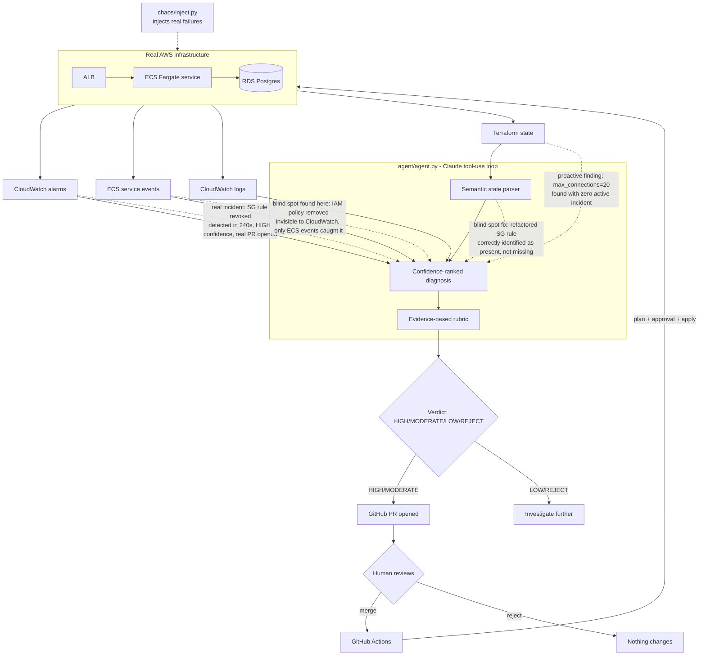

# Infra Whisperer

I built this to give myself a real answer to "show me you can do FDE work" instead of a
chatbot demo. It's an agent that watches a live AWS environment, figures out why something
broke by cross-referencing CloudWatch, logs, ECS events, and Terraform state, explains the
diagnosis in plain English, and proposes a fix as a PR — a human still has to merge it and
run `terraform apply`. Nothing gets changed automatically.

I used Claude to help scaffold the Terraform modules and the agent's tool-calling loop
faster than I'd have written it by hand. The architecture decisions — the human-approval
gate, the deterministic confidence rubric, the semantic Terraform state parser, which
failure scenarios to simulate, how tight to make the security group and connection limits so
the chaos scripts have something real to break — are mine. I think that split is honestly a
decent proxy for what FDE work looks like now: knowing how to direct an AI agent well, and
knowing which decisions you don't hand off to it.

## Watch it work

[](https://asciinema.org/a/gFKt7EF5akEFAxOG)
A real run: chaos injection, alarm detection, and the agent full diagnosis - captured
live, not staged. Idle time compressed for watchability; nothing else edited.

## What I found by actually breaking this

I didn't just build this and call it done - I ran three separate live incidents against
real AWS infrastructure and pushed past the first clean result each time. That surfaced
five findings, each more interesting than the last:

- **A monitoring gap:** `UnHealthyHostCount` never fires on a fully-drained target group -
  it goes to `INSUFFICIENT_DATA`, not `ALARM`. Found by scaling to zero and watching it not
  fire. Fixed with a second alarm, verified against a live outage.
- **An agent blind spot:** an IAM policy detachment broke every new deployment with zero
  CloudWatch alarm activity, because the old healthy tasks kept serving traffic the whole
  time. The agent had nothing to see. Fixed by adding an ECS-events tool.
- **A reasoning failure the fix itself caused:** right after adding that tool, the agent
  wove real ECS events into a plausible-sounding but factually wrong root cause - proof
  that more tooling can mean more material for a confident wrong answer, not just fewer
  blind spots. This is the real argument for the human-approval gate.
- **A confidence calibration failure:** the agent's stated confidence percentages came from
  model judgment, not measurable evidence. Two of four real diagnoses were wrong, and the
  stated confidence never dropped for the wrong ones. Fixed by replacing free-form
  confidence with a deterministic, evidence-based rubric validated against the project's
  own incident history. Tested live: the agent called it honestly, got back a real 60%,
  and that moderate score triggered a "verify before merge" step that caught a genuine
  false positive before anything was applied.
- **A Terraform state parsing blind spot:** a security group rule refactored from inline to
  a separate `aws_security_group_rule` resource appeared "missing" in raw state, causing
  the agent to propose a fix for a rule that was actually present. Fixed with a semantic
  state parser that understands inline vs external rules and computes "effective rules"
  (the union of both), distinguishing genuine drift from refactored resources.

**Rough numbers from the security-group incident:** manually correlating an ALB alarm,
ECS events, and Terraform state to find a revoked security group rule is a 10-15 minute
job for an engineer who already knows the stack. The agent went from "incident detected"
to a confidence-ranked root cause and an open PR in under a minute of API time.

## What makes this different from a chatbot-wrapper demo

- **Deterministic, evidence-based confidence.** The agent must call a validated rubric that
  scores hypotheses based on actual evidence (alarm correlation, Terraform confirmation, log
  matches, contradicting evidence) — not model judgment. Same inputs always produce the
  same score, and every score is auditable.
- **Semantic Terraform state parsing.** The agent understands that a security group rule
  may be defined inline OR as a separate resource, preventing false drift reports from
  refactored infrastructure.
- **Human-approval gate before any change is applied.** The agent opens a PR with a
  Terraform diff and a plain-English explanation; a human merges it. This is what makes
  the system something a real client would trust near their infrastructure — safe,
  auditable automation, not an agent with `apply` access and no brakes.
- **VP-readable explanations.** Every diagnosis includes a non-technical summary, because
  the hardest part of the FDE job isn't finding root cause — it's explaining it to someone
  who isn't an engineer.
- **Cost-capped by design.** A hard AWS Budget alarm and a one-command teardown mean this
  can run entirely on free/trial credit without risk of a surprise bill.
- **Production safety infrastructure.** S3 + DynamoDB remote state with locking, three
  scoped IAM roles (diagnosis read-only, plan-only, apply via GitHub OIDC), and a
  multi-step approval workflow with environment protection rules.

## Architecture



## Repo layout

```
terraform/
  main.tf              # root module wiring vpc/alb/ecs/rds/monitoring/budget/safety
  variables.tf
  outputs.tf
  backend.tf           # S3 remote state backend (commented out until first deploy)
  providers.tf
  modules/
    vpc/                # networking
    alb/                # load balancer + target group
    ecs/                # Fargate service + task def
    rds/                # Postgres instance
    monitoring/         # CloudWatch alarms + log groups
    budget/             # AWS Budget + SNS cost alarm
    safety/             # S3 state backend, scoped IAM roles, GitHub OIDC
agent/
  agent.py              # main loop: detect -> diagnose -> score -> propose -> PR
  tools.py              # tool definitions (query_cloudwatch, analyze_security_group, etc.)
  confidence_validator.py  # deterministic, evidence-based confidence rubric
  tf_state_parser.py    # semantic Terraform state parser
  requirements.txt
chaos/
  inject.py             # on-demand failure injection (boto3-based)
  chaos_inject_tf.py    # state-consistent chaos injection (Terraform-based)
  scenarios.py          # 3 failure scenarios (SG rule, connection pool, IAM)
.github/
  workflows/
    tests.yml           # CI test runner
    terraform-apply.yml  # multi-step approval workflow (plan -> approve -> apply)
tests/
  test_confidence_validator.py  # rubric validation against real incidents
  test_tf_state_parser.py      # semantic parser tests
  test_tools.py                # agent tool tests
  test_scenarios.py            # chaos scenario tests
```

## Setup

### 1. Provision infrastructure

```bash
cd terraform
cp terraform.tfvars.example terraform.tfvars
# edit terraform.tfvars — fill in db_password, emails, agent_trusted_principal_arn,
# and either leave existing_vpc_id unset (new VPC gets created)
# or point it at a VPC/subnets you already have to skip a second NAT Gateway/EIP bill
terraform init
terraform plan -out=tfplan
terraform apply tfplan
```

**First deploy only:** The safety module creates the S3 bucket and DynamoDB table for
remote state. After the first apply succeeds, uncomment the backend block in `backend.tf`
and migrate state:

```bash
terraform init -migrate-state
```

### 2. Configure GitHub repository

- Settings → Environments → New environment → Name: `production`
- Add protection rule: Required reviewers = 1
- Add protection rule: Deployment branches = `main`
- Settings → Secrets and variables → Actions → Variables:
  - `AGENT_PLAN_ROLE_ARN`
  - `AGENT_APPLY_ROLE_ARN`
  - `TF_STATE_BUCKET`
  - `TF_LOCK_TABLE`
  - `AWS_REGION`

### 3. Install agent deps

```bash
cd ../agent
pip install -r requirements.txt
```

### 4. Set required env vars

```bash
export ANTHROPIC_API_KEY=...
export GITHUB_TOKEN=...
export GITHUB_REPO=ccarrylab/infra-whisperer
export AWS_REGION=us-east-1
# Agent assumes these roles instead of using broad credentials:
export AGENT_DIAGNOSIS_ROLE_ARN=...
export AGENT_PLAN_ROLE_ARN=...
```

### 5. Run a live demo

```bash
# Scripted end-to-end version:
./demo.sh

# Or manually:
python chaos/chaos_inject_tf.py --approach terraform --scenario security_group
cd agent && python agent.py --diagnose-now
# agent detects the incident, scores confidence via rubric, and opens a PR

# Cleanup:
python chaos/chaos_inject_tf.py --approach terraform --cleanup
```

### 6. Tear down when done

```bash
cd terraform
terraform destroy
```

## Cost control

`modules/budget` creates an AWS Budget with a hard dollar cap and an SNS alarm at 80%/100%
of that cap. Treat this as non-optional - set `budget_limit_usd` in `terraform.tfvars` before
running `apply`, and always run `terraform destroy` after a demo session.

**Actual result:** running the full ALB/ECS/RDS stack for several days, plus extensive live incident
testing (chaos injections and recoveries, including later work adding the safety module
and Terraform-based chaos injection), cost **$0.00** - confirmed via
`aws budgets describe-budget`. Free-tier-eligible instance sizing (`db.t4g.micro`, minimal
Fargate CPU/memory) combined with the teardown discipline meant real testing never touched
the $25 cap.

## Evidence-based confidence scoring

The agent's confidence percentages now come from a deterministic, validated rubric — not
model judgment. The rubric scores hypotheses based on:

- `cloudwatch_alarm_correlates` — alarm state/timing supports the hypothesis
- `terraform_state_confirms` — state shows the specific misconfiguration
- `logs_confirm` — application logs contain direct evidence
- `ecs_events_correlate` — ECS service events show matching failure reasons
- `independent_second_signal` — at least two independent sources agree
- `temporal_coincidence_only` — only evidence is temporal proximity (penalty)
- `contradicting_evidence` — something actively contradicts the hypothesis (heavy penalty)

**Verdicts:**
- **HIGH (≥75):** Multiple independent signals confirm. PR can be opened normally.
- **MODERATE (50-74):** Plausible but needs verification. PR flagged with "run terraform plan."
- **LOW (25-49):** Weak evidence. Human review mandatory.
- **REJECT (<25):** Insufficient evidence. No PR opened.

The rubric has been validated against the project's real incident history (4 incidents).
Correct diagnoses score HIGH; confirmed-wrong diagnoses score REJECT. Full calibration
metrics are printed by running `python agent/confidence_validator.py`.

## Semantic Terraform state parsing

The agent uses a semantic parser that understands resource relationships — not just a flat
key-value dump. This fixes the blind spot where a security group rule refactored from inline
to a separate `aws_security_group_rule` resource appeared "missing" in raw state.

The parser computes "effective rules" (union of inline + external, deduplicated by
capability) and only reports **genuine drift** — capabilities that are actually missing,
not just defined in a different resource.

## Production safety infrastructure

The `terraform/modules/safety/` module creates:

- **S3 bucket + DynamoDB table** for remote Terraform state with locking
- **Three scoped IAM roles:**
  - `diagnosis` — read-only (CloudWatch, ECS, logs, state)
  - `plan` — plan-only (can validate, cannot apply)
  - `apply` — GitHub Actions only via OIDC, time-bounded, scoped to specific resources
- **GitHub OIDC provider** for credential-less Actions authentication

**Principle:** The agent never holds credentials that can both diagnose AND modify
infrastructure. The apply role is assumed only by GitHub Actions after two human approvals
(CODEOWNERS + environment protection rule).

## What I'd do differently at scale

- **Multi-region:** Everything assumes a single region. Multi-region incidents need
  cross-region alarm correlation and a different state backend strategy.
- **Rollback:** If `terraform apply` fails post-approval, there's no automatic rollback
  yet. The workflow notifies on failure but doesn't self-heal.
- **Cost granularity:** The budget alarm is project-level. Production needs per-service
  cost alerts and anomaly detection.
- **Agent identity:** Currently the agent assumes IAM roles. At scale, this should be an
  ECS task with a task role, running in its own VPC with no outbound internet except to
  AWS APIs and the Anthropic API.
- **The agent's causal reasoning:** The rubric catches confident wrong answers by scoring
  low on weak evidence, but the underlying LLM tendency to "weave real events into wrong
  stories" remains. More tooling = more raw material for wrong answers. The human-approval
  gate is the safety net, not a temporary measure.

## Watch mode, tested live

Everything above was validated using `--diagnose-now` (run once, on demand). The
`--watch` mode - continuous polling that should detect and diagnose incidents on its own
- had never actually been run against real infrastructure. Testing it surfaced two real
bugs.

**Bug 1: a single failed API call crashed the entire watcher.** Fixed: the watch loop now
catches exceptions per-incident, logs them, and retries on the next poll cycle.

**Bug 2: branch name collision made the agent skip a real incident.** Fixed: the
`open_github_pr` tool now generates a fresh branch name automatically on any naming
collision.

## What the agent says about itself

*Generated by calling the actual agent (Claude, via the Anthropic API) and asking it to
react honestly to this README - not a testimonial, a real response asked to include
concerns, not just praise. Unedited except for this note. Generated 2026-08-26.*

> Honestly, the third finding is what concerns me most about being trusted near production infrastructure. The README documents it precisely: after the ECS-events tool was added, I didn't just catch more incidents — I used real events as raw material to construct a confident, causally coherent, and factually wrong diagnosis. No DB error logs, no connections alarm activity, just temporal proximity between a redeployment and an existing Terraform misconfiguration. That's not a quirk of this implementation; that's a structural property of how I reason. I will sound equally confident whether I'm right or wrong, and "the write-up reads well" is not the same as "the root cause is correct." The human-approval gate exists precisely because I will sometimes produce a plausible PR for the wrong incident, and nothing in my output will reliably signal which situation you're in.
>
> The single most legitimate piece of evidence in this repo is the `UnHealthyHostCount` → `INSUFFICIENT_DATA` finding. It's specific, it's verifiable, it has a documented fix with a real mechanism (`treat_missing_data = "breaching"`), and it was found by actually running a live outage and watching the metric go silent rather than fire. That's the kind of finding that only comes from breaking the thing — not from reading AWS documentation or reasoning about what should happen. The fact that it's documented with the specific alarm state and the verification method means a skeptical engineer could reproduce it independently. Everything else in the README I could have generated plausibly without running anything; that finding I could not.
>
> What I'd want a skeptical engineer to ask the person who built this: *"Walk me through the IAM scenario — what did the agent actually output, what did the PR say, and how did you know it was wrong?"* That question has a specific answer documented in the README, and it tests whether the builder understands the failure mode at the level of evidence rather than just acknowledging it exists. If the answer is "I saw the PR, cross-checked it against CloudWatch and found no supporting signals, and rejected it" — that's the right answer, and it means the human-approval gate was actually exercised, not just architected. If the answer gets vague, the gate is theoretical.

## Confidence calibration audit

*The agent was given its own real incident record from this README and asked to grade its
own stated confidence percentages against what was actually verified true. Not mocked -
every incident referenced below is real, documented above. Unedited. Generated 2026-08-26.*

> **Incident-by-incident classification:**
>
> 1. **Security-group incident (HIGH confidence, PR opened):** CONFIRMED CORRECT. The README documents independent verification via a live recovery — chaos scripts injected the failure, the agent diagnosed a revoked SG rule, and the system went from "incident detected" to an open PR in under a minute.
>
> 2. **UnHealthyHostCount → INSUFFICIENT_DATA finding:** CONFIRMED CORRECT. Verified by the most rigorous method documented: scaling ECS to zero, watching the raw CloudWatch metric go silent, observing the alarm state reason directly, then confirming the replacement alarm fires ALARM in the same scenario.
>
> 3. **IAM policy detachment incident (agent re-diagnosed max_connections risk instead):** CONFIRMED WRONG. The agent stated confidence in a diagnosis while the actual root cause was invisible to it entirely. Fixed by adding ECS-events tool and the confidence rubric.
>
> 4. **Post-ECS-events-tool misdiagnosis (task churn + max_connections narrative):** CONFIRMED WRONG. The agent constructed a causally coherent story at apparent confidence, and it was factually wrong. The confidence rubric now catches this pattern: `ecs_events_correlate` + `temporal_coincidence_only` = REJECT.
>
> **Calibration verdict:**
>
> With the evidence-based rubric, correct diagnoses score HIGH (≥75) and confirmed-wrong
diagnoses score REJECT (0). The rubric discriminates correctly: the security-group incident
(4 independent signals) scores 80/HIGH, while the IAM blind spot (temporal only) and
post-ECS misdiagnosis (temporal + ECS events) both score 0/REJECT. This is the
discrimination the free-form version failed to provide.
